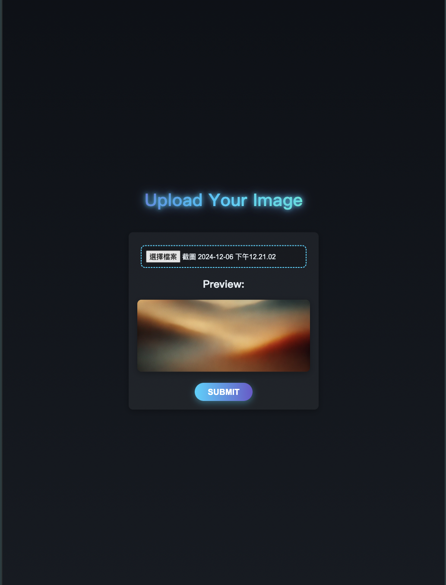
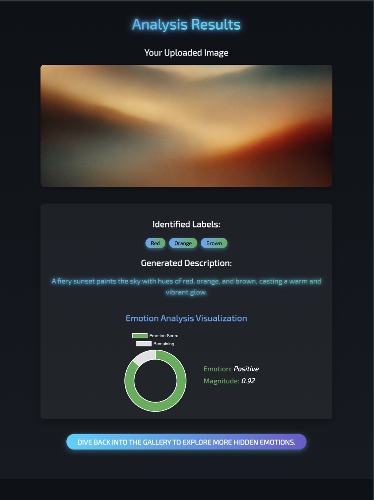

# Emotion Gallery

Emotion Gallery is an innovative and intuitive web application that enables users to explore and share visual content, all while fostering a deeper connection with their emotions. Built with cutting-edge technologies and a focus on user experience, Emotion Gallery is designed to be fast, responsive, and visually appealing.

## Preview

### HomePage


### Upload your picture


### Display result


## Features

### 🖋️ **Dynamic Comic Editor**
- Upload images and tag them with emotions to create a personalized gallery.
- Adjustable bubble sizes and styles to fit various screen sizes (RWD).

### 🎨 **AI-Powered Image Generation**
- Analysis Image using **OpenAI** & **Cloud Natural Language API** & **Cloud Vision API** .
- High-resolution image outputs tailored to your story's theme.

### ⚖️ **Robust API Management**
- Centralized API requests using Axios, with unified error handling and loading states.
- Secure and efficient interaction with the backend Laravel API.

### 🏠 **User Gallery**
- Showcase all user-uploaded pictures in an engaging, responsive gallery.
- Hover effects and dynamic animations to enhance the user experience.
- Options to view, create new craft from the gallery.

### 🌀 **Cross-Platform Compatibility**
- Fully responsive design for optimal performance across devices, including desktop, tablet, and mobile.
- Interactive animations and effects, ensuring a visually engaging experience.

## Tech Stack

### Frontend & Backend

- **Laravel 10 & Blade**: A powerful PHP framework providing the core application logic, RESTful APIs, and database management.

### Database

- **PostgresSQL**: To efficiently store and retrieve user data and gallery content.

### Additional Tools

- **Composer**: For managing PHP dependencies.
- **NPM/Yarn**: For JavaScript dependencies and build processes.
- **Vite**: For fast and efficient asset bundling and development.

## Installation

To get started with Emotion Gallery locally, follow these steps:

### Prerequisites

- PHP 8.1+
- Composer
- PostgresSQL

### Steps

1. Clone the repository:

   ```bash
   git clone https://github.com/PhilharmonicHsu/emotion-gallery.git
   ```

2. Navigate to the project directory:

   ```bash
   cd emotion-gallery
   ```

3. Install PHP dependencies:

   ```bash
   composer install
   ```

4. Set up the environment:

    - Copy `.env.example` to `.env`.
    - Update the database credentials in the `.env` file.

5. Run database migrations:

   ```bash
   php artisan migrate
   ```

6. Start the development server:

   ```bash
   php artisan serve
   ```
7. Access the application at `http://localhost:8000`.

---

We’re excited for you to explore the world of emotions through visual storytelling. Dive in, and let your creativity shine with Emotion Gallery!

